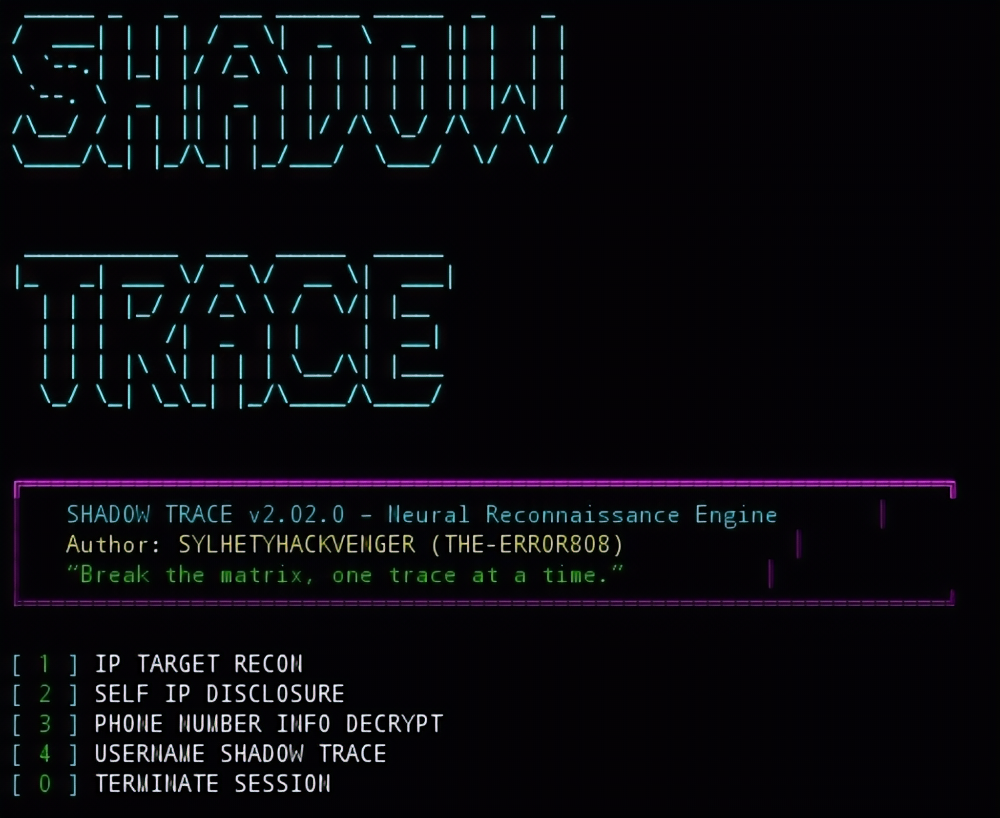

SHADOW TRACER

<b>⚡Open Source Intelligence Suite ⚡</b> 
<i>"Every packet tells a story."</i>

---

🕶️ Overview

SHADOW TRACER is a cyber intelligence and reconnaissance framework designed for security researchers, investigators, and digital explorers. It combines multiple OSINT-style utilities into a single terminal-based interface.

The platform provides rapid information gathering capabilities including IP intelligence lookups, public IP discovery, phone number metadata analysis, and large-scale username reconnaissance across social media, cybersecurity platforms, freelance marketplaces, blogging services, and educational communities.

Built with multithreading support and an immersive neon-styled interface, The suite focuses on publicly available information and metadata analysis while maintaining simplicity and speed.

---

🚀 Capabilities

- 🌐 IP Address Intelligence
- 📡 Public IP Detection
- 📱 Phone Number Metadata Analysis
- 🔍 Multi-Platform Username Recon
- ⚡ Multi-threaded Scanning Engine
- 🎨 Cyberpunk Terminal Interface
- 📊 Structured Intelligence Reports
- 🛰️ Geolocation & Network Details
- 🔐 Security Research Utility

---

📦 Installation

git clone https://github.com/yourusername/shadow-tracer.git
cd shadow-tracer

pip install requests
pip install phonenumbers
pip install colorama

Run:

python shadow_tracer.py

---

🎯 Usage

1. Launch the framework.
2. Select a module from the menu.
3. Enter the requested target information.
4. Review generated intelligence results.
5. Return to the main menu for additional operations.

Example:

python shadow_tracer.py

Select:

[1] IP TARGET RECON
[2] SELF IP DISCLOSURE
[3] PHONE NUMBER INFO DECRYPT
[4] USERNAME SHADOW TRACE

---

⚠️ Disclaimer

This project is intended for educational purposes, authorized security testing, and legitimate research only. Users are responsible for complying with all applicable laws and regulations.

---

Made with ⚡ by <b>SYLHETYHACKVENGER (THE-ERROR808)</b> 
<b>SHADOW TRACER v2.0</b> 
<i>Break the matrix, one trace at a time.</i>

